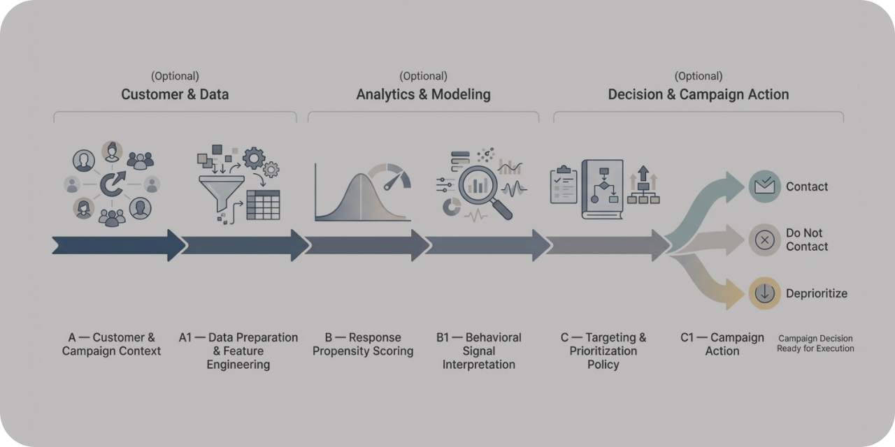

# CampaignSense

**CRM analytics para priorização de clientes e otimização de campanhas orientadas a ROI.**




---

## Visão Geral

A **CampaignSense** é uma Proof of Concept (POC) de **CRM Analytics** que demonstra como dados de clientes e histórico de campanhas podem ser utilizados para **priorizar contatos com maior retorno esperado**.

O projeto trata modelos de Machine Learning como **componentes de suporte à decisão**, conectando três elementos principais de sistemas analíticos aplicados a marketing:

- estimativa de **propensão de resposta**;
- definição de **regras de priorização de clientes**;
- avaliação de **impacto financeiro esperado da campanha**.

A proposta é demonstrar como scores analíticos podem ser transformados em **decisões operacionais claras**, alinhadas a custo de contato e retorno esperado.

---

## Problema de Negócio

Em campanhas de marketing tradicionais, é comum que empresas impactem grandes parcelas da base de clientes sem distinção clara de potencial de retorno.

Esse cenário pode gerar problemas como:

- desperdício de orçamento com clientes de baixa propensão;
- baixo retorno incremental das campanhas;
- dificuldade de justificar decisões de targeting com base em critérios objetivos.

A **CampaignSense** busca endereçar esse cenário utilizando modelos preditivos para estimar a probabilidade de resposta e definir **políticas de priorização baseadas em retorno esperado**.

---

## Abordagem da Solução

A POC implementa um pipeline completo de **CRM analytics orientado à decisão**:

- auditoria e análise exploratória dos dados de clientes e campanhas;
- segmentação comportamental de clientes;
- modelagem preditiva de propensão à resposta;
- comparação entre modelos candidatos (LightGBM e XGBoost);
- conversão do score em **regra objetiva de priorização**;
- estimativa de impacto financeiro esperado da campanha.

A abordagem busca conectar modelagem estatística a **decisões acionáveis de marketing**, indo além da previsão isolada de resposta.

---

## Tecnologias Utilizadas

- Python  
- Pandas / NumPy  
- SciPy  
- Scikit-learn  
- LightGBM  
- XGBoost  
- Matplotlib / Seaborn  

---

## Pipeline Analítico

1. Auditoria e preparação dos dados de clientes  
2. Análise exploratória orientada à decisão de negócio  
3. Segmentação comportamental de clientes  
4. Treinamento e validação de modelos preditivos  
5. Seleção do modelo campeão  
6. Conversão de scores em regras de priorização  
7. Estimativa de impacto financeiro esperado da campanha  
8. Geração de artefatos analíticos e executivos  

---

## Estrutura do Projeto

```

campaignsense/

├── data/
│   ├── raw/
│   └── processed/
│
├── src/
│   ├── evaluation.py
│   └── paths.py
│
├── notebooks/
│   ├── 01-data_audit_eda.ipynb
│   ├── 02-eda_decision.ipynb
│   ├── 03-segmentation.ipynb
│   ├── 04-modeling.ipynb
│   └── 05-profit_targeting.ipynb
│
├── references/
│   ├── 01_dicionario_de_dados.md
│   └── campaignsense-results.png
│
├── reports/
│   ├── plots/
│   ├── metrics/
│   ├── tables/
│   └── campaignsense_summary.md
│
└── README.md

```

---

## Resultados

A CampaignSense demonstra como análises de CRM podem ser estruturadas para apoiar decisões de campanha orientadas a valor.

A POC entrega:

- modelo preditivo de propensão à resposta;
- segmentação comportamental de clientes;
- regras de priorização baseadas em retorno esperado;
- estimativa de impacto financeiro da campanha;
- artefatos analíticos e executivos para suporte à decisão.

---

## Status

**POC concluída**

Este repositório representa uma entrega consolidada de CRM Analytics aplicada à priorização de campanhas de marketing.

---

## Disclaimer

Esta POC foi desenvolvida exclusivamente para fins demonstrativos.

Os dados utilizados são públicos e não contêm informações pessoais ou sensíveis.  
O projeto não deve ser utilizado diretamente em ambientes produtivos.

---

## Small Data Lab – Portfolio

Este projeto faz parte do **Small Data Lab**, um laboratório técnico dedicado à experimentação aplicada em dados, analytics e sistemas de IA.

Explore também outras POCs do laboratório:
  
- [LakeFlow](https://github.com/smalldatalabbr/lakeflow) — Pipeline Lakehouse para ingestão e organização de dados externos.  
- [RetailLens BI](https://github.com/smalldatalabbr/retaillens-bi) — Camada analítica BI-ready para diagnóstico operacional em e-commerce.  
- [DelayImpact](https://github.com/smalldatalabbr/delayimpact-analytics) — Análise que investiga o impacto de atrasos logísticos na satisfação do cliente.   
- [FraudWatch](https://github.com/smalldatalabbr/fraudwatch) — Sistema de decisão antifraude que transforma scores de ML em políticas operacionais auditáveis.  
- [DocLens](https://github.com/smalldatalabbr/doclens) — Chatbot RAG com guardrails e testes adversariais para governança de LLMs.

---

## Onde me encontrar

[Portfólio](https://jhonathan.me) | [LinkedIn](https://www.linkedin.com/in/jhonathandomingues) | [Email](mailto:hello@jhonathan.me)

---

Este repositório é licenciado sob a MIT License.
